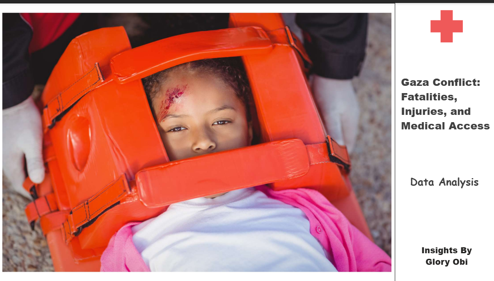
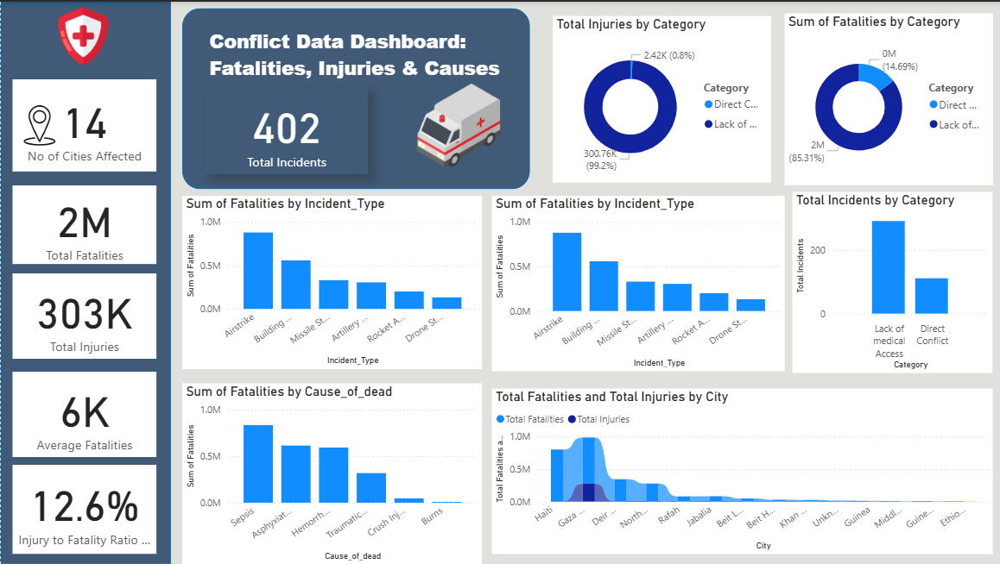

## Medical Impact of the Gaza Conflict

## Project Overview
The Gaza conflict remains one of the most pressing humanitarian crises of our time. This project uses data analytics to assess the medical impact of the conflict, highlighting casualties, incident types, and causes of death to support better response strategies. As a data analyst and MSc student in Conflict Resolution, I aimed to transform complex data into actionable insights that can inform humanitarian aid, medical intervention, and policy-making.

 ## Problem Statement
Despite growing attention, there's limited structured analysis on how different conflict-related incidents result in specific types of injuries or fatalities. Aid organizations often operate with real-time pressure, and lack of data-driven insight can lead to delays or misallocation of critical resources, such as oxygen, antibiotics, or trauma support.

This project seeks to bridge that gap by identifying patterns between:

Incident types (e.g., airstrikes, missile strikes)

Causes of death (e.g., hemorrhage, sepsis)

City-level impact and injury rates

## Data Source
Provided by: Anonymous in partnership with Project Hope

Location-based data from 14 affected cities in Gaza and surrounding regions

Categories included:

Incident types (Airstrikes, Missile Strikes, Building Collapse)

Cause of death (Sepsis, Hemorrhage, Asphyxiation)

Number of fatalities and injuries

Direct vs. indirect conflict impact

## Insights
Here’s what I found:

📌 2 million lives lost

📌 303,000 injuries

📌 14 affected cities

📌 12.6% injury-to-fatality ratio (For every death, ~12 injuries)

These numbers aren’t just statistics—they’re the echoes of a humanitarian crisis.

## The Cities That Bore the Brunt
Some cities became synonymous with tragedy. Here’s where the loss was most severe:

🔴 Haiti – 795,794 fatalities

🔴 Gaza City – 713,131 fatalities

🔴 Deir al-Balah – 337,880 fatalities

🔴 North Gaza – 271,817 fatalities

🔴 Rafah – 78,733 fatalities

 What this means: The concentration of casualties reveals the intensity of conflict in certain areas, painting a picture of who suffers the most in war.

## How Do People Die in War?
The leading causes of death tell a chilling story:

💔 833,733 deaths from sepsis – Infections from untreated wounds.

💔 613,733 deaths from asphyxiation – Crushed under debris, suffocated in airstrikes.

💔 592,746 deaths from hemorrhage – Bled out with no medical aid in sight.

 Key takeaway: Many of these deaths were preventable. Medical access could have saved thousands.

## The Deadliest Weapons of War
Some methods of attack proved far deadlier than others:

Airstrikes – 879,578 deaths | 273,665 injuries

Building Collapse – 555,845 deaths | 6,613 injuries

Missile Strikes – 330,183 deaths | 6,330 injuries

 The reality: Airstrikes didn’t just destroy infrastructure—they wiped out entire communities.

## The Hidden Crisis: Lack of Medical Access
Beyond direct conflict, another crisis unfolded—people dying not from bombs, but from neglect.

⚠️ 2 million deaths (85%) from direct conflict

⚠️ 345,000 deaths (15%) from lack of medical access

Imagine surviving an airstrike, only to die because no hospital could treat your wounds. That’s the cruel aftermath of war.

## Why This Matters
Conflict isn’t just about politics—it’s about human lives. This data isn’t just numbers; it’s a call to action.

 We need:
✔️ More humanitarian aid to prevent avoidable deaths.

✔️ Better medical infrastructure to treat survivors.

✔️ Global accountability to protect civilians.

As someone studying Conflict Resolution, I believe data is a powerful tool for change. Numbers can shape policies. Insights can drive action. And awareness can spark movements.

